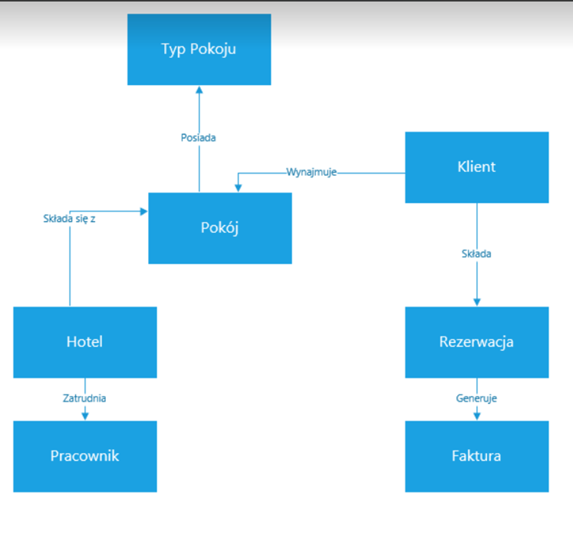
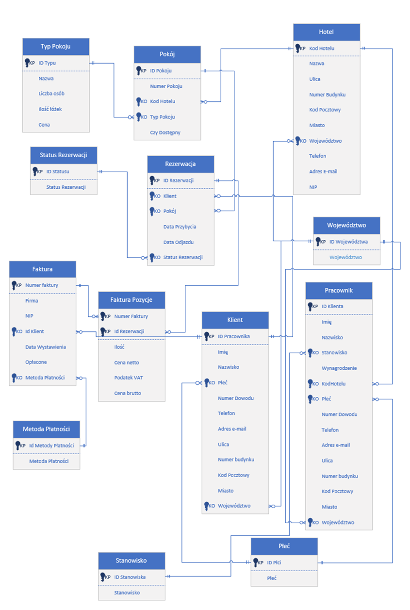
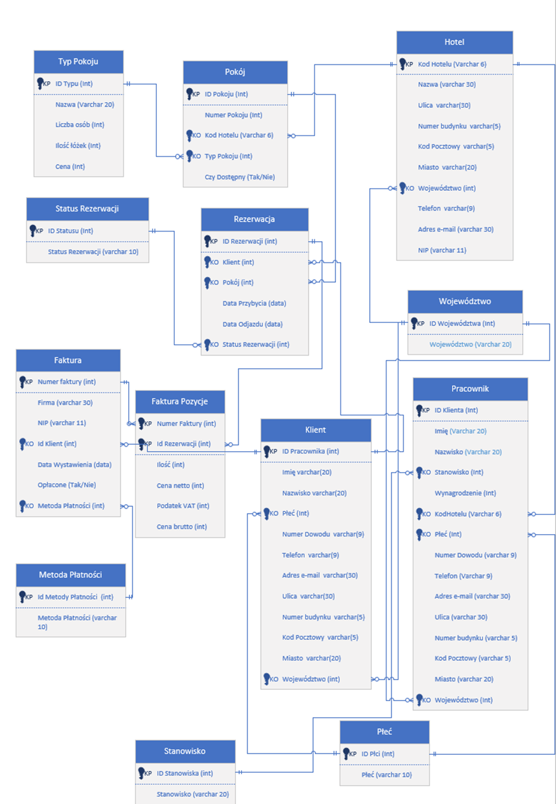

This is a fully documented MS Access project for a hotel) being a part of the University of Lodz DBs course

## DATABASE – HOTEL

**Authors:** Paweł Żurawski, Patryk Mielke

### Summary
The database contains information about rooms, bookings, payments and their methods, as well as clients, invoices, employees, and their positions, including related forms and reports.

---

### Table of Contents

1. **User Guide** — 5
2. **Project Background Description** — 5
3. **Project Description** — 5
4. **Normalization/Denormalization** — 5
5. **Database Model** — 6
   - Entities — 6
   - Attributes — 6
   - Relationships — 10
6. **Table Listing** — 11
7. **Business Rules** — 12
8. **Conceptual Model** — 13
9. **Logical Model** — 14
10. **Physical Model** — 15
11. **Table Index Listing** — 16
12. **Queries** — 17
    - KwDaneDoFakturaPozycje — 17
    - KwDaneKlienta — 17
    - KwDostepnePokojeWTerminie — 18
    - KwFaktura — 21
    - KwFakturaPozycje — 22
    - KwPokojePosegregowane — 23
    - KwRezerwacjaWyborPokoju — 24
    - KwWolnePokoje — 26
    - KwZajetePokoje — 26
    - oblozenie_pokoi_w_danym_okresie — 27
    - oblozenie_w_danym_okresie — 28
    - oblozenie_w_danym_roku — 29
    - oblozenie_w_danym_roku_miesieczne — 29
    - rezerwacjeNadchodzące — 31
    - rezerwacjeTrwające — 31
    - suma_przychodow_w_danym_okresie — 32
    - suma_przychodow_w_danym_roku — 33
    - suma_przychodow_w_danym_roku_kwartalnie — 33
    - suma_przychodow_w_danym_roku_miesiecznie — 35
13. **Reports** — 37
    - oblozenie_pokoi_w_danym_okresie — 37
    - oblozenie_w_danym_okresie — 38
    - oblozenie_w_danym_roku — 39
    - oblozenie_w_danym_roku_miesieczne — 39
    - RaWolnePokoje — 41
    - RaZajetePokoje — 42
    - rezerwacjeNadchodzące — 42
    - rezerwacjeTrwające — 43
    - suma_przychodow_w_danym_okresie — 43
    - suma_przychodow_w_danym_roku — 44
    - suma_przychodow_w_danym_roku_kwartalnie — 45
    - suma_przychodow_w_danym_roku_miesiecznie — 46
14. **Templates** — 47
    - WzórFaktury — 47
15. **Forms** — 48
    - AplikacjaHotel — 48
    - FoFaktura — 61
    - FoFakturaPozycje — 61
    - FoHotel — 62
    - FoInneFormularze — 62
    - FoKlient — 65
    - FoMetodaPłatności — 65
    - FoPokoje — 66
    - FoPracownik — 67
    - FoRaporty — 68
    - FoRezerwacja — 68
    - FoRezerwacjeNadchodzące — 69
    - FoRezerwacjeTrwające — 69
    - FoSkracanie — 70
    - FoStanowisko — 70
    - FoTypPokoju — 71
    - ListaPokoiDoPrzedluzenia — 72
    - oblozenie_pokoi_w_danym_okresie — 74
    - oblozenie_w_danym_okresie — 75
    - oblozenie_w_danym_roku — 76
    - oblozenie_w_danym_roku_miesiecznie — 76
    - suma_przychodow_w_danym_okresie — 77
    - suma_przychodow_w_danym_roku — 78
    - suma_przychodow_w_danym_roku_kwartalnie — 79
    - suma_przychodow_w_danym_roku_miesiecznie — 79
    - wolne_pokoje_w_danym_terminie — 81

---

### User Guide

#### Project Background Description
The hotel rents rooms to clients for leisure purposes. The documented database includes information about rooms, bookings, payments and their methods, clients, invoices, employees, and their positions, along with details related to the above. The database supports booking and canceling stays, checking in and out clients, as well as generating invoices and reports on room occupancy and revenue.

#### Project Description
The database contains information about hotel rooms, bookings, payments, clients, and employees with their positions. It also includes queries to check room occupancy for a user-specified period, overall occupancy for a user-specified period, yearly and monthly occupancy, and hotel revenue for a period or year (broken down by months/quarters), as well as ongoing and upcoming bookings. The aforementioned queries have been used to create forms and reports that are also included in the database. The database is equipped with a set of forms designed to manage table contents while validating the accuracy of input data. The most important of these is the Hotel Application, which allows for making reservations, checking in and out, generating reports, and managing tables. The reports concern overall hotel occupancy for a user-specified period, individual room occupancy, monthly occupancy throughout the year, or hotel revenue for a user-specified period or year (broken down by months/quarters), as well as ongoing and upcoming bookings.

#### Normalization/Denormalization
All attributes are atomic, thus the database adheres to the first normal form. Each attribute depends only on the primary key and not on other attribute values, meeting the second normal form requirements. Additionally, there are no transitive dependencies, thus the database meets the third normal form requirements. Denormalization has not been applied as the intended users of this database are assumed to have limited database knowledge, and denormalization would reduce the clarity of the database.

## Database Model

### Entities

**Table 1: Entity Overview**

| Name                 | Description                                |
|----------------------|--------------------------------------------|
| Faktura              | Stores invoice data.                      |
| Hotel                | Stores hotel information.                 |
| Klient               | Stores client information.                |
| Metoda Płatności     | Stores supported payment methods.         |
| Płeć                 | Stores a list of genders.                 |
| Pokój                | Stores information about rooms in the hotel. |
| Pracownik            | Stores employee information.              |
| Rezerwacja           | Stores reservation details.               |
| Stanowisko           | Stores a list of job positions in the hotel. |
| Status Rezerwacji    | Stores reservation status.                |
| Typ Pokoju           | Stores information about room types.      |
| Województwo          | Stores a list of provinces.               |

### Attributes

**Table 2: Faktura Attributes**

| Attribute            | Data Type  | Required    | Description                     |
|----------------------|------------|-------------|---------------------------------|
| Numer Faktury        | Number     | Required    | Primary key                    |
| Klient               | Number     | Required    | Foreign key                    |
| Firma                | Text(50)   | Optional    | Foreign key                    |
| Nip                  | Text(10)   | Optional    |                                |
| Rezerwacja           | Number     | Required    | Foreign key                    |
| Kwota                | Currency   | Required    |                                |
| Data wystawienia     | Date       | Required    | Today                          |
| Opłacone             | Yes/No     | Required    |                                |
| Metoda płatności     | Number     | Required    | Foreign key                    |

**Table 3: Hotel Attributes**

| Attribute            | Data Type  | Required    | Description                     |
|----------------------|------------|-------------|---------------------------------|
| Kod Hotelu           | Text(6)    | Required    | Primary key                    |
| Nazwa                | Text(50)   | Required    |                                |
| Ulica                | Text(50)   | Required    |                                |
| Numer budynku        | Text(10)   | Required    |                                |
| Kod pocztowy         | Text(6)    | Required    |                                |
| Miasto               | Text(50)   | Required    |                                |
| Województwo          | Number     | Required    | Foreign key                    |
| Telefon              | Text(9)    | Required    |                                |
| Adres E-mail         | Text(80)   | Required    |                                |
| NIP                  | Text(10)   | Required    |                                |
| Numer Rachunku       | Text(26)   | Required    |                                |

**Table 4: Klient Attributes**

| Attribute            | Data Type  | Required    | Description                     |
|----------------------|------------|-------------|---------------------------------|
| Id Klienta           | Number     | Required    | Primary key                    |
| Imię                 | Text(20)   | Required    |                                |
| Nazwisko             | Text(30)   | Required    |                                |
| Płeć                 | Number     | Required    | Foreign key                    |
| Numer dowodu         | Text(9)    | Required    |                                |
| Telefon              | Text(9)    | Required    |                                |
| Adres E-mail         | Text(80)   | Required    |                                |
| Ulica                | Text(80)   | Required    |                                |
| Numer Budynku        | Text(10)   | Required    |                                |
| Kod Pocztowy         | Text(6)    | Required    |                                |
| Miasto               | Text(50)   | Required    |                                |
| Województwo          | Number     | Required    | Foreign key                    |

**Table 5: Metoda Płatności Attributes**

| Attribute            | Data Type  | Required    | Description                     |
|----------------------|------------|-------------|---------------------------------|
| Id Metody            | Number     | Required    | Primary key                    |
| Metoda Płatności     | Text(20)   | Required    |                                |

**Table 6: Płeć Attributes**

| Attribute            | Data Type  | Required    | Description                     |
|----------------------|------------|-------------|---------------------------------|
| Id Płci              | Number     | Required    | Primary key                    |
| Nazwa                | Text(9)    | Required    |                                |

**Table 7: Pokój Attributes**

| Attribute            | Data Type  | Required    | Description                     |
|----------------------|------------|-------------|---------------------------------|
| Id Pokoju            | Number     | Required    | Primary key                    |
| Numer Pokoju         | Number     | Required    |                                |
| Kod Hotelu           | Text(6)    | Required    |                                |
| Typ Pokoju           | Number     | Required    | Foreign key                    |
| Czy Dostępny         | Yes/No     | Required    |                                |

**Table 8: Pracownik Attributes**

| Attribute            | Data Type  | Required    | Description                     |
|----------------------|------------|-------------|---------------------------------|
| Id Pracownika        | Number     | Required    | Primary key                    |
| Imię                 | Text(20)   | Required    |                                |
| Nazwisko             | Text(30)   | Required    |                                |
| Stanowisko           | Number     | Required    | Foreign key                    |
| Wynagrodzenie        | Currency   | Required    |                                |
| Kod Hotelu           | Text(6)    | Required    |                                |
| Płeć                 | Number     | Required    | Foreign key                    |
| Numer dowodu         | Text(9)    | Required    |                                |
| Telefon              | Text(9)    | Required    |                                |
| Adres E-mail         | Text(80)   | Required    |                                |
| Ulica                | Text(80)   | Required    |                                |
| Numer Budynku        | Text(10)   | Required    |                                |
| Kod Pocztowy         | Text(6)    | Required    |                                |
| Miasto               | Text(50)   | Required    |                                |
| Województwo          | Number     | Required    | Foreign key                    |

**Table 9: Rezerwacja Attributes**

| Attribute            | Data Type  | Required    | Description                     |
|----------------------|------------|-------------|---------------------------------|
| Id Rezerwacji        | Number     | Required    | Primary key                    |
| Klient               | Number     | Required    | Foreign key                    |
| Pokój                | Number     | Required    | Foreign key                    |
| Data Przybycia       | Date       | Required    |                                |
| Data Odjazdu         | Date       | Required    |                                |
| Status Rezerwacji    | Number     | Required    | Foreign key                    |

**Table 10: Stanowisko Attributes**

| Attribute            | Data Type  | Required    | Description                     |
|----------------------|------------|-------------|---------------------------------|
| Id Stanowiska        | Number     | Required    | Primary key                    |
| Stanowisko           | Text(40)   | Required    |                                |

**Table 11: Status Rezerwacji Attributes**

| Attribute            | Data Type  | Required    | Description                     |
|----------------------|------------|-------------|---------------------------------|
| Id Status            | Number     | Required    | Primary key                    |
| Status Rezerwacji    | Text(20)   | Required    |                                |

**Table 12: Typ Pokoju Attributes**

| Attribute            | Data Type  | Required    | Description                     |
|----------------------|------------|-------------|---------------------------------|
| Id Typu              | Number     | Required    | Primary key                    |
| Nazwa                | Text(30)   | Required    |                                |
| Liczba osób          | Number     | Required    |                                |
| Ilość łóżek          | Number     | Required    |                                |
| Cena                 | Currency   | Required    |                                |

**Table 13: Województwo Attributes**

| Attribute            | Data Type  | Required    | Description                     |
|----------------------|------------|-------------|---------------------------------|
| Id Województwa       | Number     | Required    | Primary key                    |
| Województwo          | Text(19)   | Required    |                                |

### Relationships

**Table 14: Entity Relationships**

| Parent Entity        | Child Entity           | Cardinality | Type            | Existence |
|----------------------|-------------------------|-------------|-----------------|-----------|
| Hotel                | Pokój                   | 1:N         | Identifying     | Required  |
| Hotel                | Pracownik               | 1:N         | Identifying     | Required  |
| Województwo          | Hotel                   | 1:N         | Non-identifying | Required  |
| Województwo          | Klient                  | 1:N         | Non-identifying | Required  |
| Województwo          | Pracownik               | 1:N         | Non-identifying | Required  |
| Płeć                 | Klient                  | 1:N         | Non-identifying | Required  |
| Płeć                 | Pracownik               | 1:N         | Non-identifying | Required  |
| Stanowisko           | Pracownik               | 1:N         | Identifying     | Required  |
| Typ Pokoju           | Pokój                   | 1:N         | Non-identifying | Required  |
| Pokój                | Rezerwacja              | 1:N         | Identifying     | Required  |
| Klient               | Rezerwacja              | 1:N         | Identifying     | Required  |
| Status Rezerwacji    | Rezerwacja              | 1:N         | Non-identifying | Required  |
| Rezerwacja           | Faktura                 | 1:1         | Identifying     | Required  |
| Metoda Płatności     | Faktura                 | 1:N         | Non-identifying | Required  |

### Business Rules

| Use Case                        | Implementation Description                       | Example Action                       | Implementation Location |
|---------------------------------|--------------------------------------------------|-------------------------------------|-------------------------|
| Enforce correct date format      | Data Odjazdu > Data Przybycia                    | Appropriate error message            | Database                |
| Enforce correct NIP format       | 0000000000                                       | 1234567890                          | Database                |
| Enforce correct hotel code format | !LL0000                                          | LO0001                              | Database                |
| Enforce correct postal code format| 00\-000                                          | 12-345                              | Database                |
| Enforce correct phone number format | 900\-000\-000                                  | 123-456-789                         | Database                |
| Enforce correct email format     | ((Like "*?@?*.?*") And (Not Like "*[ ,;]*"))     | test@test.pl                         | Database                |
| Enforce correct first name format | >L<LL?????????????                              | Jan                                 | Database                |
| Enforce correct last name format | >L<LL?????????????                              | Kowalski                            | Database                |
| Enforce correct ID number format  | LLL\-000000                                     | Abc-123456                          | Database                |
| Enforce correct bank account format | 00\ 0000\ 0000\ 0000\ 0000\ 0000\ 0000      | 82 1020 5226 0000 6102 0417 7895   | Database                |

### Conceptual model



### Logical model



### Physical model



### Tables

- Faktura
- FakturaPozycje
- Hotel
- Klient
- MetodaPłatności
- Płeć
- Pokój
- Pracownik
- Rezerwacja
- Stanowisko
- StatusRezerwacji
- TypPokoju
- Województwo

### Indexes

- NumerFaktury
- KodHotelu
- IdKlienta
- IdMetodaPłatności
- IdPłci
- IdPokoju
- IdPracownika
- IdRezerwacji
- IdStanowiska
- IdStatus
- IdTypu
- Idwojewodztwa

## Kwerendy

### KwDaneDoFakturaPozycje

**SQL:**

```sql
SELECT Rezerwacja.IdRezerwacji, TypPokoju.Cena AS CenaBrutto, 1+[DataOdjazdu]-[DataPrzybycia] AS Ilosc
FROM TypPokoju 
INNER JOIN (Pokój 
INNER JOIN (Klient 
INNER JOIN Rezerwacja ON Klient.[IdKlienta] = Rezerwacja.Klient) 
ON Pokój.[IdPokoju] = Rezerwacja.Pokoj) 
ON TypPokoju.[IdTypu] = Pokój.[Typpokoju];
```

Description:
Returns results containing three columns: IdRezerwacji, CenaBrutto, and Ilosc, where Ilosc is the result of calculations performed on the DataOdjazdu and DataPrzybycia columns from the Rezerwacja table, with an additional value of 1. CenaBrutto represents the room price from the TypPokoju table. The result includes data from the joined tables: Klient, Pokój, Rezerwacja, and TypPokoju.

### KwDaneKlienta

**SQL:**

```sql
SQL: SELECT Klient.IdKlienta, [Imię] & " " & [Nazwisko] AS [Imię i nazwisko], Klient.Telefon AS Telefon
FROM Klient;
```

Description: Returns results that include three columns: "IdKlienta" - customer identifier, "[Imię i nazwisko]" - concatenated string of the customer's first and last name separated by a space, "Telefon" - customer's phone number. The result includes data from the "Klient" table, where each tuple will contain information about the customer's identifier, their first and last name, and their phone number.


### KwDostepnePokojeWTerminie

**SQL:**

```sql
PARAMETERS [Forms]![FoRezerwacja]![DataPrzybycia] DateTime, [Forms]![FoRezerwacja]![DataOdjazdu] DateTime;
SELECT DISTINCT P.[NumerPokoju] AS Pokój, P.Typpokoju AS Typ, P.IdPokoju
FROM Pokój AS P LEFT JOIN Rezerwacja AS R ON P.[IdPokoju] = R.Pokoj
WHERE (
    ((R.DataPrzybycia IS NULL AND [Forms]![FoRezerwacja]![DataPrzybycia] < [Forms]![FoRezerwacja]![DataOdjazdu])
    OR ([Forms]![FoRezerwacja]![DataPrzybycia] < [Forms]![FoRezerwacja]![DataOdjazdu] AND R.DataOdjazdu IS NULL)
    OR (R.DataPrzybycia IS NOT NULL AND R.DataOdjazdu IS NOT NULL AND ([Forms]![FoRezerwacja]![DataPrzybycia] >= R.DataOdjazdu OR [Forms]![FoRezerwacja]![DataOdjazdu] <= R.DataPrzybycia)))
    OR ((R.StatusRezerwacji IN (3, 4) AND (SELECT COUNT(*) FROM Rezerwacja AS R2 WHERE R2.Pokoj = P.[IdPokoju] AND R2.IdRezerwacji <> R.IdRezerwacji AND ([Forms]![FoRezerwacja]![DataPrzybycia] >= R2.DataPrzybycia AND [Forms]![FoRezerwacja]![DataPrzybycia] < R2.DataOdjazdu) OR ([Forms]![FoReRezerwacja]![DataOdjazdu] > R2.DataPrzybycia AND [Forms]![FoRezerwacja]![DataOdjazdu] <= R2.DataOdjazdu))) = 0)
    OR ((R.StatusRezerwacji IN (1, 2) AND (SELECT COUNT(*) FROM Rezerwacja AS R2 WHERE R2.Pokoj = P.[IdPokoju] AND R2.IdRezerwacji <> R.IdRezerwacji AND ([Forms]![FoRezerwacja]![DataPrzybycia] >= R2.DataPrzybycia AND [Forms]![FoRezerwacja]![DataPrzybycia] < R2.DataOdjazdu) OR ([Forms]![FoRezerwacja]![DataOdjazdu] > R2.DataPrzybycia AND [Forms]![FoRezerwacja]![DataOdjazdu] <= R2.DataOdjazdu)) AND R2.StatusRezerwacji IN (1, 2)) > 0))
    AND (((SELECT COUNT(*) FROM Rezerwacja AS R3 WHERE R3.Pokoj = P.[IdPokoju] AND R3.DataPrzybycia = [Forms]![FoRezerwacja]![DataPrzybycia] AND R3.DataOdjazdu = [Forms]![FoRezerwacja]![DataOdjazdu] AND R3.StatusRezerwacji IN (3, 4)) > 0)
    OR ((SELECT COUNT(*) FROM Rezerwacja AS R4 WHERE R4.Pokoj = P.[IdPokoju] AND R4.DataPrzybycia = [Forms]![FoRezerwacja]![DataPrzybycia] AND R4.DataOdjazdu = [Forms]![FoRezerwacja]![DataOdjazdu] AND R4.StatusRezerwacji IN (1, 2)) > 0)
    OR ((SELECT COUNT(*) FROM Rezerwacja AS R5 WHERE R5.Pokoj = P.[IdPokoju] AND R5.DataPrzybycia = [Forms]![FoRezerwacja]![DataPrzybycia] AND R5.DataOdjazdu = [Forms]![FoRezerwacja]![DataOdjazdu]) = 0));
```

Description: Returns available hotel rooms based on the selected check-in and check-out dates from the form. It considers different booking scenarios and room availability, taking into account booking statuses and dates.


### KwFaktura

**SQL:**

```sql
SELECT Faktura.[NumerFaktury], Faktura.Firma AS FirmaKlienta, Faktura.NIP AS NIPKlienta, [Klient_1].[Imię] & " " & [Klient_1].[Nazwisko] AS Klient, Faktura.[DataWystawienia], Faktura.Opłacone, Faktura.[MetodaPłatności], "Pokój '" & [Typpokoju].Nazwa & "'" AS Pokój, FakturaPozycje.Ilość, FakturaPozycje.[Cenanetto], FakturaPozycje.[PodatekVAT], FakturaPozycje.CenaBrutto, Hotel.Nazwa AS Hotel, [Hotel].[Ulica] & " " & [Hotel].[NumerBudynku] AS Adres1, [Hotel].[Miasto] & " " & [Hotel].[KodPocztowy] AS Adres2, Hotel.Telefon, Hotel.NIP AS NIPHotelu, Hotel.[NumerRachunku]
FROM Klient AS Klient_1 INNER JOIN (Klient INNER JOIN (Hotel INNER JOIN (TypPokoju INNER JOIN ((Pokój INNER JOIN Rezerwacja ON Pokój.[IdPokoju] = Rezerwacja.Pokoj) INNER JOIN (Faktura INNER JOIN FakturaPozycje ON Faktura.[NumerFaktury]=FakturaPozycje.[NumerFaktury]) ON Rezerwacja.IdRezerwacji=FakturaPozycje.[IdRezerwacji]) ON [Typpokoju].[IdTypu]=Pokój.[Typpokoju]) ON Hotel.[KodHotelu] = Pokój.[KodHotelu]) ON Klient.[IdKlienta] = Rezerwacja.Klient) ON Klient_1.[IdKlienta]=Faktura.[IdKlient]
WHERE (((Faktura.NumerFaktury)=Forms![AplikacjaHotel]!PodformularzNawigacji.Form![NumerFaktury]));
```

Description: Contains detailed information related to the invoice, such as invoice number, client details, hotel details, room details, quantity, net prices, VAT, gross price, and others. The result pertains to an invoice with a specific invoice number provided from the hotel application form.


### KwFakturaPozycje

**SQL:**

```sql
SELECT Rezerwacja.Klient, Rezerwacja.[StatusRezerwacji]
FROM StatusRezerwacji INNER JOIN (TypPokoju INNER JOIN (Pokój INNER JOIN Rezerwacja ON Pokój.[IdPokoju]=Rezerwacja.Pokoj) ON [Typpokoju].[Id Typu]=Pokój.[Typpokoju]) ON [StatusRezerwacji].[Id Status]=Rezerwacja.[StatusRezerwacji]
WHERE (((Rezerwacja.[StatusRezerwacji])=2 Or (Rezerwacja.[StatusRezerwacji])=3));
```

Description: Returns information about clients and booking status for reservations with statuses 2 or 3. The result comes from the joined tables: StatusRezerwacji, TypPokoju, Pokój, and Rezerwacja.


### KwPokojePosegregowane

**SQL:**

```sql
SELECT Pokój.NumerPokoju, Pokój.Typpokoju
FROM Pokój
ORDER BY Pokój.NumerPokoju;
```

Description: Contains information about room numbers and types, sorted by room number in ascending order. The result comes from the "Pokój" table.


### KwRezerwacjaWyborPokoju

**SQL:**

```sql
SELECT Pokój.[Numer Pokoju] AS Pokój, [Typpokoju].[Liczba Osób] AS Osoby, [Typpokoju].Name, [Typpokoju].[Ilość łóżek] AS Łóżka
FROM TypPokoju INNER JOIN Pokój ON [Typpokoju].[Id Typu]=Pokój.[Typ pokoju];
```

Description: Contains information regarding room numbers, number of people, room type names, and number of beds. The result comes from the "TypPokoju" and "Pokój" tables, with data joined based on room type and category identifiers.


### KwWolnePokoje

**SQL:**

```sql
SELECT Pokój.[Id Pokoju], Pokój.[Numer Pokoju] AS Pokój, [Typpokoju].Nazwa, [Typpokoju].[Liczba Osób]
FROM TypPokoju INNER JOIN Pokój ON [Typpokoju].[Id Typu]=Pokój.[Typ pokoju]
WHERE (((Pokój.[Czy dostępny])=Yes));
```

Description: Contains information about available rooms, including room ID, room number, room type name, and number of people. It returns only rooms that are available.


### KwZajetePokoje

**SQL:**

```sql
SELECT Pokój.[NumerPokoju], Pokój.[Typpokoju], [Typpokoju].[Liczba Osób]
FROM TypPokoju INNER JOIN Pokój ON [Typpokoju].[Id Typu]=Pokój.[Typpokoju]
WHERE (((Pokój.[Czydostępny])=No));
```

Description: Contains information about rooms marked as unavailable, including room number, room type, and number of people. The result comes from the "Pokój" table.


### oblozenie_pokoi_w_danym_okresie

**SQL:**

```sql
SELECT r.Pokoj, Count(r.Pokoj) AS oblozenie, r.DataPrzybycia AS Od, r.DataOdjazdu AS Do
FROM Rezerwacja AS r
WHERE (((r.DataPrzybycia) Between Forms!oblozenie_pokoi_w_danym_okresie!DataPrzyjazdu And Forms!oblozenie_pokoi_w_danym_okresie!DataOdjazdu) And ((r.DataOdjazdu) Between Forms!oblozenie_pokoi_w_danym_okresie!DataPrzyjazdu And Forms!oblozenie_pokoi_w_danym_okresie!DataOdjazdu))
GROUP BY r.Pokoj, r.DataPrzybycia, r.DataOdjazdu
ORDER BY r.Pokoj DESC;
```

Description: Contains information about room occupancy in a specified period. Results are grouped by room number, arrival date, and departure date, allowing for the analysis of occupancy over time.


### oblozenie_w_danym_okresie

**SQL:**

```sql
SELECT Count(r.Pokoj) AS oblozenie, Format(Forms!oblozenie_w_danym_okresie!DataPrzyjazdu,"dd/mm/yyyy") AS Od, Format(Forms!oblozenie_w_danym_okresie!DataOdjazdu,"dd/mm/yyyy") AS Do
FROM Rezerwacja AS r
WHERE (((r.DataPrzybycia) Between Forms!oblozenie_w_danym_okresie!DataPrzyjazdu And Forms!oblozenie_w_danym_okresie!DataOdjazdu)  AND ((r.DataOdjazdu) Between Forms!oblozenie_w_danym_okresie!DataPrzyjazdu And Forms!oblozenie_w_danym_okresie!DataOdjazdu));
```

Description: Contains overall occupancy for all rooms in a specified period. Occupancy is counted as the number of reservations within the given period. The "From" and "To" dates are formatted based on the form.


### oblozenie_w_danym_roku

**SQL:**

```sql
SELECT Count(r.Pokoj) AS oblozenie, Forms!oblozenie_w_danym_roku!RokRaport AS rok
FROM Rezerwacja AS r
WHERE YEAR(r.DataPrzybycia) = Forms!oblozenie_w_danym_roku!RokRaport AND YEAR(r.DataOdjazdu) = Forms!oblozenie_w_danym_roku!RokRaport;
```

Description: Contains monthly room occupancy for a given year based on reservations. Occupancy is calculated for each month of the year, with missing data in a given month showing a value of 0.

### oblozenie_w_danym_roku_miesieczne

**SQL:**

```sql
SELECT IIf(IsNull(r.oblozenie),0,r.oblozenie) AS oblozenie, m.rok, m.miesiac
FROM (SELECT DISTINCT Year(DataPrzybycia) AS rok, 1 AS miesiac FROM Rezerwacja     UNION ALL SELECT DISTINCT Year(DataPrzybycia) AS rok, 2 AS miesiac FROM Rezerwacja     UNION ALL SELECT DISTINCT Year(DataPrzybycia) AS rok, 3 AS miesiac FROM Rezerwacja     UNION ALL SELECT DISTINCT Year(DataPrzybycia) AS rok, 4 AS miesiac FROM Rezerwacja     UNION ALL SELECT DISTINCT Year(DataPrzybycia) AS rok, 5 AS miesiac FROM Rezerwacja     UNION ALL SELECT DISTINCT Year(DataPrzybycia) AS rok, 6 AS miesiac FROM Rezerwacja     UNION ALL SELECT DISTINCT Year(DataPrzybycia) AS rok, 7 AS miesiac FROM Rezerwacja     UNION ALL SELECT DISTINCT Year(DataPrzybycia) AS rok, 8 AS miesiac FROM Rezerwacja     UNION ALL SELECT DISTINCT Year(DataPrzybycia) AS rok, 9 AS miesiac FROM Rezerwacja     UNION ALL SELECT DISTINCT Year(DataPrzybycia) AS rok, 10 AS miesiac FROM Rezerwacja     UNION ALL SELECT DISTINCT Year(DataPrzybycia) AS rok, 11 AS miesiac FROM Rezerwacja     UNION ALL SELECT DISTINCT Year(DataPrzybycia) AS rok, 12 AS miesiac FROM Rezerwacja )  AS m LEFT JOIN (SELECT Count(IdRezerwacji) AS oblozenie, Year(DataPrzybycia) AS rok, Month(DataPrzybycia) AS miesiac FROM Rezerwacja WHERE Year(DataPrzybycia) = Forms!oblozenie_w_danym_roku_miesiecznie!RokRaport     AND Year(DataOdjazdu) = Forms!oblozenie_w_danym_roku_miesiecznie!RokRaport GROUP BY Year(DataPrzybycia), Month(DataPrzybycia))  AS r ON (m.miesiac = r.miesiac) AND (m.rok = r.rok)
WHERE m.rok = Forms!oblozenie_w_danym_roku_miesiecznie!RokRaport
ORDER BY m.rok, m.miesiac;
```

Description: Contains monthly room occupancy for a given year based on reservations. Occupancy is calculated for each month of the year, with missing data in a given month showing a value of 0.


### rezerwacjeNadchodzące

**SQL:**

```sql
SELECT R.IdRezerwacji, P.NumerPokoju, R.DataPrzybycia
FROM Pokój AS P INNER JOIN Rezerwacja AS R ON P.IdPokoju = R.Pokoj
WHERE (((R.DataPrzybycia) Between Date() And Date()+7) AND ((R.StatusRezerwacji)=1));
```

Description: Contains information about upcoming reservations (within the next week from today) and reservation status (status 1). The result includes reservation ID, room number, and arrival date.


### rezerwacjeTrwające

**SQL:**

```sql
SELECT R.IdRezerwacji, P.NumerPokoju, R.DataOdjazdu
FROM Pokój AS P INNER JOIN Rezerwacja AS R ON P.IdPokoju = R.Pokoj
WHERE (((R.StatusRezerwacji)=2));
```

Description: Contains information about currently ongoing reservations (status 2). The result includes reservation ID, room number, and departure date.


### suma_przychodow_w_danym_okresie

**SQL:**

```sql
SELECT Sum(fp.CenaBrutto) AS przychody, Format(Forms!suma_przychodow_w_danym_okresie!DataPrzyjazdu,"dd/mm/yyyy") AS Od, Format(Forms!suma_przychodow_w_danym_okresie!DataOdjazdu,"dd/mm/yyyy") AS Do
FROM FakturaPozycje AS fp, Faktura AS f
WHERE (((f.DataWystawienia) Between Forms!suma_przychodow_w_danym_okresie!DataPrzyjazdu And Forms!suma_przychodow_w_danym_okresie!DataOdjazdu) And ((fp.NumerFaktury)=f.NumerFaktury));
```

Description: Contains total revenue for a specified period. Revenue is calculated based on invoices and their items issued during that period. The "From" and "To" dates are formatted according to the form.

### suma_przychodow_w_danym_roku

**SQL:**

```sql
SELECT SUM(fp.CenaBrutto) AS przychody, Forms!suma_przychodow_w_danym_roku!RokRaport AS rok
FROM FakturaPozycje AS fp, Faktura AS f
WHERE (YEAR(f.DataWystawienia) = Forms!suma_przychodow_w_danym_roku!RokRaport) AND ((fp.NumerFaktury)=f.NumerFaktury);
```

Description: Contains total revenue for a specified year. Revenue is calculated based on invoices and their items for that year.


### suma_przychodow_w_danym_roku_kwartalnie

**SQL:**

```sql
SELECT IIf(IsNull(fp.przychody),0,fp.przychody) AS przychody, m.rok, m.kwartal
FROM (SELECT DISTINCT Year(DataWystawienia) AS rok, 1 AS kwartal FROM Faktura     UNION ALL SELECT DISTINCT Year(DataWystawienia) AS rok, 2 AS kwartal FROM Faktura     UNION ALL SELECT DISTINCT Year(DataWystawienia) AS rok, 3 AS kwartal FROM Faktura     UNION ALL SELECT DISTINCT Year(DataWystawienia) AS rok, 4 AS kwartal FROM Faktura )  AS m LEFT JOIN (SELECT Year(DataWystawienia) AS rok, IIf(Month(DataWystawienia) In (1,2,3),1,IIf(Month(DataWystawienia) In (4,5,6),2,IIf(Month(DataWystawienia) In (7,8,9),3,4))) AS kwartal, Sum(CenaBrutto) AS przychody FROM FakturaPozycje INNER JOIN Faktura ON FakturaPozycje.NumerFaktury = Faktura.NumerFaktury GROUP BY Year(DataWystawienia), IIf(Month(DataWystawienia) In (1,2,3),1,IIf(Month(DataWystawienia) In (4,5,6),2,IIf(Month(DataWystawienia) In (7,8,9),3,4))))  AS fp ON (m.kwartal = fp.kwartal) AND (m.rok = fp.rok)
WHERE m.rok = Forms!suma_przychodow_w_danym_roku_kwartalnie!RokRaport
ORDER BY m.rok, m.kwartal;
```

Description: Contains quarterly revenue for a specified year. It calculates the sum of revenue for each quarter of the year based on invoices and their items.

### suma_przychodow_w_danym_roku_miesiecznie

**SQL:**

```sql
SELECT NZ(Sum(fp.CenaBrutto),0) AS przychody, m.rok, m.miesiac
FROM (SELECT DISTINCT Year(DataWystawienia) AS rok, 1 AS miesiac FROM Faktura     UNION ALL SELECT DISTINCT Year(DataWystawienia) AS rok, 2 AS miesiac FROM Faktura     UNION ALL SELECT DISTINCT Year(DataWystawienia) AS rok, 3 AS miesiac FROM Faktura     UNION ALL SELECT DISTINCT Year(DataWystawienia) AS rok, 4 AS miesiac FROM Faktura     UNION ALL SELECT DISTINCT Year(DataWystawienia) AS rok, 5 AS miesiac FROM Faktura     UNION ALL SELECT DISTINCT Year(DataWystawienia) AS rok, 6 AS miesiac FROM Faktura     UNION ALL SELECT DISTINCT Year(DataWystawienia) AS rok, 7 AS miesiac FROM Faktura     UNION ALL SELECT DISTINCT Year(DataWystawienia) AS rok, 8 AS miesiac FROM Faktura     UNION ALL SELECT DISTINCT Year(DataWystawienia) AS rok, 9 AS miesiac FROM Faktura     UNION ALL SELECT DISTINCT Year(DataWystawienia) AS rok, 10 AS miesiac FROM Faktura     UNION ALL SELECT DISTINCT Year(DataWystawienia) AS rok, 11 AS miesiac FROM Faktura     UNION ALL SELECT DISTINCT Year(DataWystawienia) AS rok, 12 AS miesiac FROM Faktura )  AS m LEFT JOIN (SELECT Year(DataWystawienia) AS rok, Month(DataWystawienia) AS miesiac, CenaBrutto FROM FakturaPozycje INNER JOIN Faktura ON FakturaPozycje.NumerFaktury = Faktura.NumerFaktury)  AS fp ON (m.miesiac = fp.miesiac) AND (m.rok = fp.rok)
WHERE m.rok = Forms!suma_przychodow_w_danym_roku_miesiecznie!RokRaport
GROUP BY m.rok, m.miesiac
ORDER BY m.rok, m.miesiac;
```

Description: Contains monthly revenue for a given year. The sum of gross prices from invoice items is grouped by year and month, with missing data in a given month showing a value of 0.

## Reports

### oblozenie_pokoi_w_danym_okresie
Description: This report is generated based on the query oblozenie_pokoi_w_danym_okresie through the oblozenie_pokoi_w_danym_okresie form. It provides information on the number of reservations for a specific room number within a given time period (from January 1, 2023, to January 1, 2024), including the dates for which reservations have been made.

### oblozenie_w_danym_okresie
Description: This report is generated based on the query oblozenie_w_danym_okresie through the oblozenie_w_danym_okresie form. It provides information on the number of rooms reserved during a specified period (from … to …, with the example period being January 1, 2023, to January 1, 2024).

### oblozenie_w_danym_roku
Description: This report is generated based on the query oblozenie_w_danym_roku through the oblozenie_w_danym_roku form. It provides information on the number of rooms reserved in the user-specified year (in this case, the year 2023).

### oblozenie_w_danym_roku_miesieczne
Description: This report is generated based on the query oblozenie_w_danym_roku_miesiecznie through the oblozenie_w_danym_roku_miesiecznie form. It provides information on the number of rooms reserved in the user-specified year, broken down by month (for example, all months of 2023).

### RaWolnePokoje
Description: This report is generated based on the query KwWolnePokoje through the AplikacjaHotel form. It provides information on the available rooms in the hotel.

### RaZajetePokoje
Description: This report is generated based on the query KwZajetePokoje through the AplikacjaHotel form. It provides information on the occupied rooms in the hotel.

### rezerwacjeNadchodzące
Description: This report is generated based on the query rezerwacjeNadchodzące through the AplikacjaHotel form. It provides information on upcoming reservations in the hotel—those with an arrival date within the next 7 days.

### rezerwacjeTrwające
Description: This report is generated based on the query rezerwacjeTrwające through the AplikacjaHotel form. It provides information on current ongoing reservations in the hotel.

### suma_przychodow_w_danym_okresie
Description: This report is generated based on the query suma_przychodow_w_danym_okresie through the suma_przychodow_w_danym_okresie form. It provides information on the total revenue achieved by the hotel for a specified period (from … to …, with the example period being January 1, 2023, to January 1, 2024).

### suma_przychodow_w_danym_roku
Description: This report is generated based on the query suma_przychodow_w_danym_roku through the suma_przychodow_w_danym_roku form. It provides information on the total revenue achieved by the hotel for the user-specified year (in this case, the year 2023).

### suma_przychodow_w_danym_roku_kwartalnie
Description: This report is generated based on the query suma_przychodow_w_danym_roku_kwartalnie through the suma_przychodow_w_danym_roku_kwartalnie form. It provides information on the total revenue achieved by the hotel for the user-specified year, broken down by quarters (for example, quarters of 2023).

### suma_przychodow_w_danym_roku_miesiecznie
Description: This report is generated based on the query suma_przychodow_w_danym_roku_miesiecznie through the suma_przychodow_w_danym_roku_miesiecznie form. It provides information on the total revenue achieved by the hotel for the user-specified year, broken down by months.

### WzórFaktury
Description: This report contains the invoice template onto which data is applied when generating invoices in the Aplikacja Hotel system.
